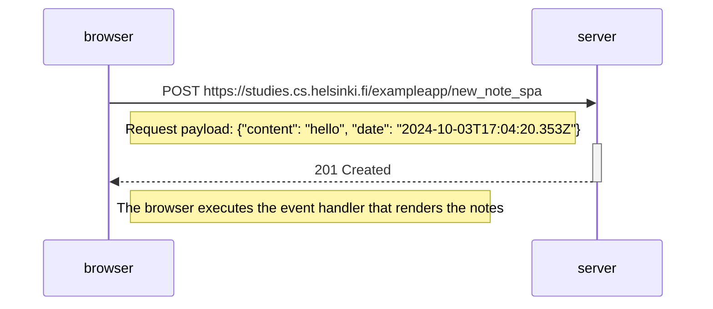

```mermaid
sequenceDiagram
    participant browser
    participant server

    browser->>server: POST https://studies.cs.helsinki.fi/exampleapp/new_note_spa
    
    Note right of browser: Request payload: {"content": "hello", "date": "2024-10-03T17:04:20.353Z"}
    
    activate server
    server-->>browser: 201 Created
    deactivate server
    
    Note right of browser: The browser executes the event handler that renders the notes
```